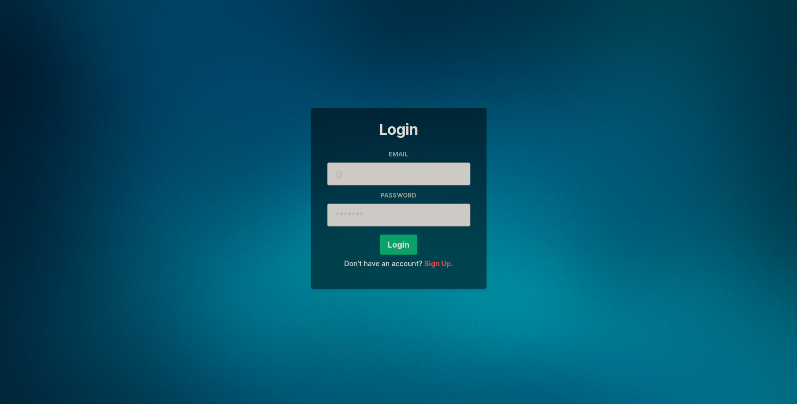
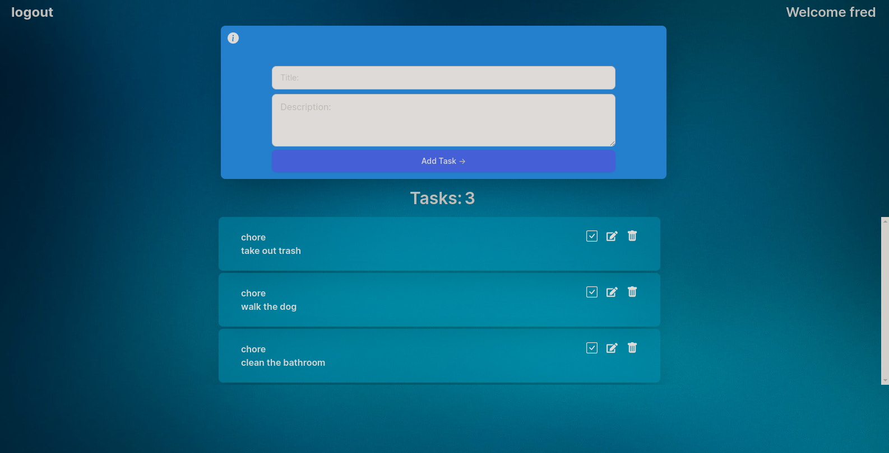
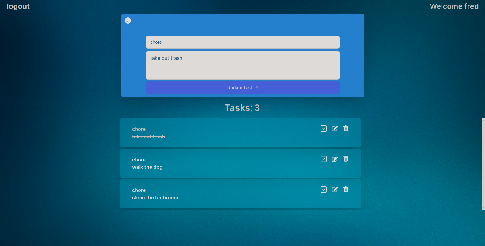

# Task Master 
# Project Description
Task master is note taking platform, with state management is  handled by Redux.
Users are required to loging. To loging users have to register.
This data is then saved in a mongoose database, where it is then varified with JWT token to allow,k user access.

# **How to Install and Run Car Inventory application**
* Download and extract  the file and open it, in your IDE of choice
* Open terminal and cd frontend
* npm install
* cd backend
* npm install
* in frontend npm run dev to launch
* in backend npm run dev to launch
  
# The technologies used in this projects are as follows:
* React js
* Boostrap
* Chakra-ui
* React router-dom
* Zustand
* Redux
* Vite
* Dotenv
* Express
* Mongoose
* Nodemon

# 
# 
# 
